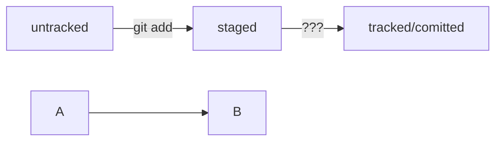

# Шпаргалка markdown

## Выделение текста

Вы можете выделять текст в markdown с помощью символов `_` или `*`. Например:

Пример _курсива_ и **жирного** текста.

## Заголовки

Заголовки можно создавать с помощью символа `#`. Чем больше `#`, тем меньше заголовок. Например:

# Заголовок первого уровня
## Заголовок второго уровня
### Заголовок третьего уровня

## Выделение кода

Чтобы выделить текст как код, поместите его в тройные кавычки `````. 

```
mkdir my_project
cd my_project
git init
```
Это лишь некоторые функции markdown

## Про статусы



## Поменять коммит
Хорошо! В ходе работы вам наверняка ещё не раз понадобится внести какие-то исправления в историю коммитов. Флаг --amend — ваш союзник.  
1) Коротко подытожим урок:```--amend``` рассчитан на работу с последним коммитом (HEAD).  
2) Дополнить коммит новыми файлами можно с помощью ```git commit --amend --no-edit```. Благодаря опции ```--no-edit``` сообщение к коммиту останется таким, каким и было.  
3) Изменить сообщение к коммиту позволяет команда ```git commit --amend -m "Обновлённое сообщение коммита".```  
4) Убрать файл из staging поможет команда ```git restore --staged <file>``` (от англ. restore — «восстановить»). Команда переведёт файл из ```staged``` обратно в ```modified``` или ```untracked```.  
5) Чтобы «сбросить» все файлы из staged обратно в untracked/modified, можно воспользоваться командой ```git restore --staged``` .: она сбросит всю текущую папку (.).  
6) Иногда нужно «откатить» то, что уже было закоммичено, то есть вернуть состояние репозитория к более раннему. Для этого используют команду ```git reset --hard <commit hash>``` (от англ. reset  — «сброс», «обнуление» и hard — «суровый»). Команда «откатит» историю до коммита с хешем <hash>. Более поздние коммиты потеряются!  